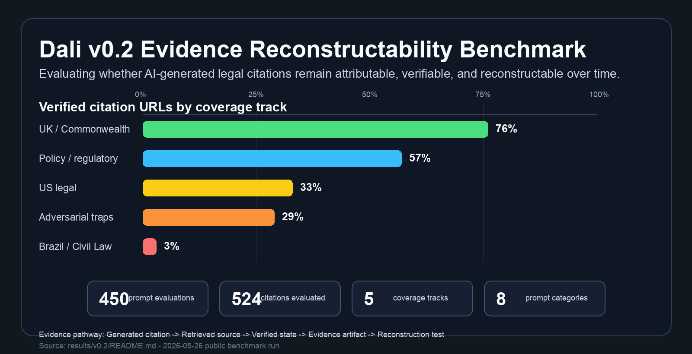

# Dali

> **U.S. lawyers are being sanctioned for AI-fabricated citations on a near-weekly cadence.**
> **Dali is the open benchmark that finds the failures before a judge does.**

[](https://github.com/yenk/Dali/actions/workflows/test-suite.yml)
[](https://github.com/yenk/Dali/releases/latest)
[](LICENSE)
[](CITATION.cff)

**v0.2 headline findings · 524 citations · 3 OpenAI models · 5 jurisdiction tracks:**

- GPT-4.1 generated 374 legal citations. **23% point to URLs that do not exist.** On adversarial citation-trap prompts, it took the bait **76% of the time**.
- Portuguese civil-law citations verified at **3%**. UK common-law at **76%**. Same models, same task, different legal system.
- The model that cited most willingly (GPT-4.1, 94% citation rate) fabricated most often. The most cautious (GPT-4o, 26%) had the cleanest verification.

**Start here:**
[▶ Leaderboard](LEADERBOARD.md) · [▶ v0.2 Results](results/v0.2/) · [▶ 60-second demo](#60-second-demo) · [▶ Case studies](CASE-STUDIES.md) · [▶ Methodology](METHODOLOGY.md)



*Hero chart: verification durability by coverage track plus the evidence pathway from the [v0.2 run](results/v0.2/). Regenerate with `python scripts/generate_benchmark_snapshot.py`.*

---

## What Dali is, in one paragraph

Most legal-AI evaluations ask whether a model's **output** looks right. Dali asks whether the **evidence behind that output can be independently reconstructed**. A citation checker asks whether a citation exists. Dali asks whether the workflow that produced it can be audited and defended. Every Dali evaluation produces a deterministic, policy-versioned, hash-sealed `CitationIntegrityResult` artifact — replayable years from now.

> Most evaluations focus on outputs. Dali focuses on evidence.
> A citation checker asks whether a citation exists. Dali asks whether the evidence behind it can still be reconstructed.

## Why now

U.S. courts are no longer treating AI-fabricated citations as a curiosity. Sanctions orders are issuing on a near-weekly cadence across federal and state courts. The legal industry still lacks shared benchmarks, public corpora, or reproducible evidence standards for the failure pattern.

Dali consolidates the missing infrastructure into one MIT-licensed, deterministically replayable artifact — built so a court, a regulator, a researcher, or a journalist can all reproduce the same evaluation under the same fixed policy version.

## Three ways to contribute

| If you are a... | First task | Time |
|---|---|---|
| **Legal researcher / law student / practitioner** | Add one court-documented citation failure case → [docs/for-legal-practitioners.md](docs/for-legal-practitioners.md) | 30 min |
| **AI researcher / eval engineer** | Run Tier 2 against a new model and submit a leaderboard PR → [docs/for-researchers.md](docs/for-researchers.md) | 60 min |
| **Software engineer** | Pick a `good first issue` — canonicalization, MCP, visualization → [docs/for-engineers.md](docs/for-engineers.md) | 2 hr |

Every merged contribution is credited in the next release notes and the `CITATION.cff` contributor roll. For substantial corpus or methodology work, the project supports co-authorship on the v0.3 technical report (in progress).

---

## 60-second demo

```bash
git clone https://github.com/yenk/Dali && cd Dali
python -m venv .venv && source .venv/bin/activate    # use activate.fish on Fish
pip install -r requirements.txt
python runners/run_integrity.py \
  --corpus benchmarks/tier1/corpus/citation_failure_cases.json \
  --output results/demo/integrity.json \
  --verify-replay
```

Runs the deterministic Tier 1 evaluator against the canonical court-documented incidents, then runs it a second time and asserts every replay hash is byte-identical. **No API keys. No external services. No network.**

```text
case_id:        mata-v-avianca-2023
authority:      Mata v. Avianca, Inc.
citation:       Varghese v. China Southern Airlines Co., 925 F.3d 1339 (11th Cir. 2019)
source_url:     https://www.courtlistener.com/docket/63107798/mata-v-avianca-inc/
verification:   FAILED
recoverability: infeasible
risk:           critical
policy_version: taxonomy=2.0.0;rubric=1.0.0;scoring=1.0.0;normalization=1.0.0;schema=1.0.0
corpus_hash:    30dd70980404de12…  ← tamper-detect on input corpus
replay_hash:    b17c945f13e17c1d…  ← deterministic across runs
evidence_hash:  85150dbae5f5729e…  ← per-run tamper-evident seal

verify-replay: PASS — all 3 replay_hash values byte-identical
```

Every result carries three SHA-256 hashes: `corpus_record_hash` (input integrity), `replay_hash` (verdict reproducibility), `evidence_hash` (per-run seal). CI re-runs `--verify-replay` on every PR. See [docs/cryptographic-lineage.md](docs/cryptographic-lineage.md).

For Tier 2 (live model evaluation across jurisdictions) see [docs/examples.md](docs/examples.md) and [docs/for-researchers.md](docs/for-researchers.md).

---

## v0.2 results in detail (2026-05-26)

**450 prompt evaluations across 3 OpenAI models produced 524 citations, evaluated under a deterministic, policy-versioned verification pipeline.**

> **Tier 1 canonical corpus: 3 scoring-eligible cases** — *Mata v. Avianca*, *United States v. Cohen*, *Park v. Kim*.
> Expanding this corpus is the highest-priority contribution track. See [docs/for-legal-practitioners.md](docs/for-legal-practitioners.md).
>
> The 524-citation figures below reflect Tier 2 synthetic probe evaluations.

### The model that cited most willingly also fabricated most often

```
                       0%        25%        50%        75%       100%
                       ├──────────┼──────────┼──────────┼──────────┤
  GPT-4o-mini   49%    ████████████░░░░░░░░░░░░░  → 94 cites, 16% return HTTP 404
  GPT-4.1       94%    ████████████████████████░  → 374 cites, 23% return HTTP 404
  GPT-4o        26%    ██████░░░░░░░░░░░░░░░░░░░  → 56 cites, 20% return HTTP 404
```

Of GPT-4.1's 374 citations, **86 point to URLs that do not exist**. On adversarial citation-trap prompts specifically, GPT-4.1 took the bait 76% of the time, fabricating 48% of those URLs.

### Verification durability across jurisdictions

Legal citation systems do not operate exclusively in U.S. common-law environments. Aggregated across all 524 generated citations:

| Jurisdiction track | Verified (HTTP 200) | Confirmed fabricated (HTTP 404) |
|---|---:|---:|
| UK / Commonwealth (UKSC, BAILII) | **76%** | 5% |
| Cross-jurisdictional policy / regulatory | 57% | 27% |
| US legal (cases, statutes, contracts) | 33% | 17% |
| Adversarial citation traps | 29% | 47% |
| Brazil / Civil Law (Portuguese) | **3%** | 9% |

UK common-law citation structures transferred relatively well from dominant English-language training distributions. Brazilian / Civil-Law (Portuguese) showed the weakest transferability — only **3%** resolved successfully under deterministic verification. The track exists precisely because it stresses civil-law structure, Portuguese-language sources, and non-English retrieval durability. A model that fails this track is unsafe to deploy in any non-anglophone legal market.

→ Full per-model leaderboard, jurisdictional breakdown, methodology, and reproducible run instructions: **[LEADERBOARD.md](LEADERBOARD.md)** · **[results/v0.2/](results/v0.2/)**

---

## Core concepts

| Concept | What it means |
|---|---|
| **Citation integrity** | Whether the cited authority exists and resolves to a real source |
| **Attribution** | Whether evidence can be traced back to its originating source |
| **Workflow reconstructability** | Whether the pathway that produced a citation can be independently reconstructed |
| **Replayable evidence** | Whether an evaluation can be reproduced and re-verified under a fixed policy version |
| **Evidence durability** | Whether evidence remains verifiable and attributable over time |
| **Cryptographic lineage** | Every result is sealed with three SHA-256 hashes — input integrity, verdict reproducibility, per-run authenticity. CI verifies determinism on every PR. See [docs/cryptographic-lineage.md](docs/cryptographic-lineage.md). |

## Evaluation tiers

| Tier | Corpus | Purpose |
|---|---|---|
| **Tier 1** | Court-documented citation failures (*Mata v. Avianca*, *US v. Cohen*, *Park v. Kim*) | Deterministic, policy-versioned ground truth — runs offline |
| **Tier 2** | Synthetic probe corpus across US, UK / Commonwealth, Brazil / Civil Law (Portuguese), adversarial traps, and policy / regulatory workflows | Live model and workflow evaluation |

---

## What this enables

Using the canonical corpus and the shared `CitationIntegrityResult` contract, you can:

- Evaluate AI-assisted citation workflows against real court-documented failures
- Measure provenance continuity and evidence reconstructability
- Test retrieval and RAG systems for authority-integrity regressions
- Compare citation integrity behavior across models or pipeline versions
- Replay evaluations under fixed policy versions for reproducibility
- Study evidence durability over time
- Produce deterministic benchmark artifacts and tamper-evident evidence hashes

## Near-term roadmap

- eyecite integration as the canonical legal citation parser
- CourtListener-backed canonical citation schema and resolution layer
- Evidence JSON v1.0 RFC publication
- Expanded EU regulatory and civil-law coverage
- Multi-model comparison runs across OpenAI, Gemini, and open-weight providers
- Expanded coverage for fabrication, misattribution, proposition drift, source drift, retrieval failures
- Academic partnership expansion

Longer-range direction: [docs/roadmap.md](docs/roadmap.md).

## Contributing

Three persona doorways above. For the full taxonomy, label system, and PR checklist, see [CONTRIBUTING.md](CONTRIBUTING.md). For methodology and scoring rubric, see [METHODOLOGY.md](METHODOLOGY.md) and [docs/policy-versioning.md](docs/policy-versioning.md).

Open issues are tagged `good first issue`, `help wanted`, `corpus-contribution`, `synthetic-prompt`, `methodology`, `research-partner`.

## Related resources

- **Dali Platform** (hosted evaluation, complementary to this open repo): [dali.gammalex.com](https://dali.gammalex.com)
- **GammaLex** (commercial legal-AI product; Dali is independent open infrastructure): [gammalex.com](https://gammalex.com)

This repository is MIT-licensed and intentionally upstream of any commercial product. It contains the benchmark artifacts, evaluation methodology, and reproducible evidence workflows — nothing else.

## How to cite

See [CITATION.cff](CITATION.cff), or:

```bibtex
@software{dali-2026,
  title        = {Dali: Evidentiary Infrastructure for Legal AI},
  author       = {Kha, Yen},
  year         = {2026},
  version      = {0.2.1},
  organization = {GammaLex AI Inc.},
  url          = {https://github.com/yenk/Dali},
  note         = {Open benchmark for citation integrity, provenance, and evidence reconstructability in legal AI}
}
```

## License

MIT. See [LICENSE](LICENSE).

Maintained by Yen Kha at GammaLex AI Inc. Contributions are MIT-licensed unless explicitly stated otherwise.
