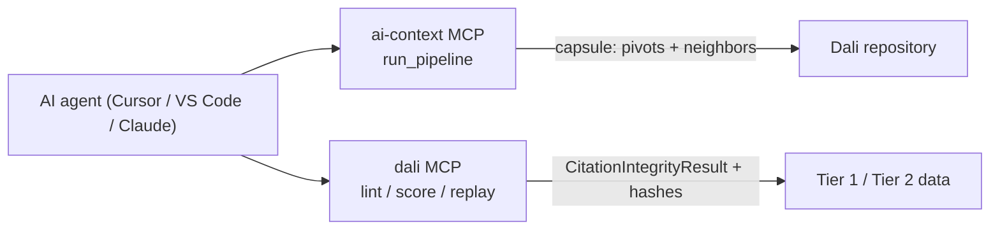

# Agent context setup (AI Context + Dali MCP)

Dali contributors often need two kinds of agent help:

1. **Repository navigation** — find the right module, schema, or runner without a manual codebase tour.
2. **Corpus workflows** — validate, score, and replay citation-failure records through the deterministic evaluator.

[AI Context](../tools/ai-context/README.md) handles (1). [Dali MCP](../tools/mcp/README.md) handles (2). They are complementary, not overlapping.

## Architecture



| Layer | Server | Primary tools | Output |
|---|---|---|---|
| Code context | `ai-context` | `run_pipeline`, `get_context_capsule` | Token-budgeted markdown capsule grounded in indexed source |
| Domain validation | `dali` | `lint`, `score`, `replay`, `probe`, `draft`, `pack` | JSON validation reports and cryptographic lineage hashes |

## One-time setup

### 1. Python dependencies (Dali MCP)

```bash
pip install -r requirements.txt
```

### 2. Node dependencies (AI Context)

```bash
cd tools/ai-context && npm install && cd ../..
```

### 3. Cursor

This repo ships `.cursor/mcp.json` with both servers pre-wired. Open the repo in Cursor and confirm both `dali` and `ai-context` appear under MCP servers.

The routing rule in `.cursor/rules/ai-context-routing.mdc` tells agents when to call each server.

### 4. VS Code

Add `.vscode/mcp.json` (not committed — `.vscode/` is gitignored) or use your user-level MCP config:

```json
{
  "servers": {
    "dali": {
      "type": "stdio",
      "command": "python3",
      "args": ["-m", "tools.mcp"],
      "cwd": "${workspaceFolder}"
    },
    "ai-context": {
      "type": "stdio",
      "command": "node",
      "args": ["${workspaceFolder}/tools/ai-context/mcp-server.js"],
      "cwd": "${workspaceFolder}"
    }
  }
}
```

### 5. Claude Desktop

```json
{
  "mcpServers": {
    "dali": {
      "command": "python3",
      "args": ["-m", "tools.mcp"],
      "cwd": "/absolute/path/to/Dali"
    },
    "ai-context": {
      "command": "node",
      "args": ["/absolute/path/to/Dali/tools/ai-context/mcp-server.js"],
      "cwd": "/absolute/path/to/Dali"
    }
  }
}
```

Use absolute paths. `~` and relative paths are unreliable in MCP configs.

## Smoke tests

**AI Context** — ask your agent:

> Use `run_pipeline` with task "where is replay_hash computed in the Tier 1 evaluator?"

Expected: a capsule referencing `dali/runners/run_integrity.py` and related lineage modules.

**Dali MCP** — ask your agent:

> `score` the Mata v. Avianca record from `data/benchmark/tier1/corpus/citation_failure_cases.json`.

Expected: `verification: FAILED`, three SHA-256 hashes, `risk: critical`.

## What gets indexed

AI Context indexes text/code files under the repo root and skips heavy directories (`node_modules`, `.git`, `dist`, `data/results` artifacts, etc.). The local SQLite index lives at `.ai-context/index.db` (gitignored).

Python is fully supported (`.py` files). The dependency graph extractor is regex-driven and strongest for JS/TS, but keyword + path retrieval works well for Dali's Python layout (`dali/`, `tools/`, `tests/`).

## Environment variables

| Variable | Default | Effect |
|---|---|---|
| `AI_CONTEXT_INDEX_WORKERS` | auto (max 8) | Cap worker-thread indexing concurrency |
| `AI_CONTEXT_TOKEN_FIRST` | `1` (on) | Compact single-pivot capsules for symbol queries |
| `AI_CONTEXT_TOKEN_FIRST_SINGLE_PIVOT` | `1` (on) | Allow up to 2 pivots when set to `0` |

## Related

- [tools/mcp/README.md](../tools/mcp/README.md) — Dali contributor MCP tools
- [for-engineers.md](for-engineers.md) — codebase tour
- [CONTRIBUTING.md](../CONTRIBUTING.md) — PR checklist
